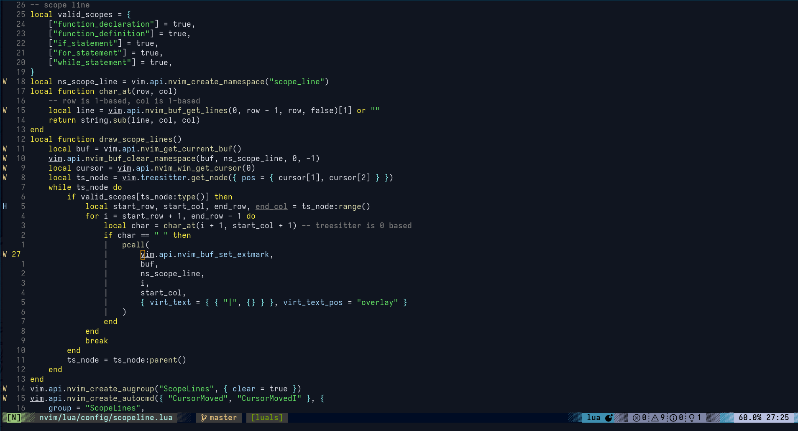

# Setup
```{bash}
nvim --headless -c 'SyncPkgs' -c 'qa'
# or :SyncPkgs inside nvim then restart
```
# Screenshot
<table width="100%">
  <tr>
    <th>Example</th>
  </tr>
  <tr>
    <td width="100%">
      
    </td>
  </tr>
</table>
